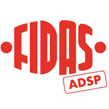

# PrenotaQui 2.2 - Sistema Prenotazioni FIDAS



Sistema di prenotazione online per le donazioni di sangue del **Gruppo FIDAS adsp di San Giusto Canavese**.

## 📋 Descrizione

**PrenotaQui 2.2** è un'applicazione web moderna e intuitiva che permette ai donatori FIDAS di:
- ✅ Registrarsi e accedere con credenziali personali
- ✅ Visualizzare la lista delle persone idonee alla donazione
- ✅ Prenotare una fascia oraria per la donazione
- ✅ Gestire le prenotazioni in modo autonomo

## 🚀 Caratteristiche Principali

### Per gli Utenti
- **Sistema di Login/Registrazione** sicuro con Firebase Authentication
- **Lista Persone Idonee** aggiornabile in tempo reale
- **Prenotazione Fascia Oraria** con visualizzazione posti disponibili
- **Evidenziazione Prenotazione Personale** in rosso FIDAS
- **Navigazione Intuitiva** con frecce direzionali (← Indietro / Avanti →)
- **Privacy GDPR-compliant** con informativa integrata
- **Interfaccia Responsive** ottimizzata per mobile e desktop
- **Feedback Visivo Completo** con loader durante operazioni asincrone

### Per gli Amministratori
- **Area Riservata** con password dedicata
- **Gestione Pagine** dinamica (creazione, rinomina, eliminazione)
- **Blocco Prenotazioni** selettivo per pagina con bypass admin
- **Import/Export Excel** per gestione liste con validazione robusta
- **Modifica Posti Disponibili** per fascia oraria (da 1 a 20 posti)
- **Gestione Lista Idonei** con caricamento da Excel e validazione dati
- **Gestione Landing Page** con date donazioni e info medico
- **Gestione Footer** con contatti dinamici
- **Sistema di Conferma Robusto** per operazioni critiche

## 🎨 Design e UX

- **Palette Colori FIDAS** (Blu, Rosso, Verde, Arancione, Viola)
- **Badge Colorati** per disponibilità posti:
  - 🟢 Verde: Più di 3 posti
  - 🟡 Giallo: 1-3 posti
  - 🔴 Rosso: Esaurito
- **Frecce Direzionali** nei pulsanti di navigazione per guida visiva
- **Animazioni Fluide** e transizioni moderne
- **Feedback Visivo** su tutte le azioni con loader e messaggi chiari
- **Modal Personalizzati** con posizionamento ottimizzato
- **Header e Footer Globali** sempre visibili

## 🎯 Codice Colori Pulsanti

- 🟦 **Blu FIDAS**: Pulsanti Avanti/Indietro con frecce
- 🟣 **Viola**: Area Riservata
- 🟢 **Verde**: Prenota/Aggiorna Lista
- 🟠 **Arancione**: Esci Area Riservata
- 🔴 **Rosso**: Esci/Reset/Rimuovi

## 🛠️ Tecnologie Utilizzate

- **Frontend:**
  - Vue.js 3 (Composition API)
  - HTML5 / CSS3 (Custom Properties)
  - JavaScript ES6+

- **Backend:**
  - Firebase Authentication
  - Firebase Realtime Database

- **Librerie:**
  - SheetJS (xlsx) per Import/Export Excel
  - Vue 3 Global Production Build

## 📦 Struttura Progetto

```
prenotaqui/
├── index.html          # Pagina principale
├── app.js             # Logica applicazione (Vue.js + Firebase)
├── style.css          # Stili personalizzati
├── logofidas.png      # Logo FIDAS
├── README.md          # Questo file
├── CHANGELOG.md       # Storico versioni
└── LICENSE            # Licenza MIT
```

## 🔧 Installazione e Configurazione

### Prerequisiti
- Un account Firebase con Database Realtime abilitato
- Un server web (Apache, Nginx, o hosting statico)

### Setup

1. **Clona il repository:**
```bash
git clone https://github.com/LorisGioga/PrenotaQui-donazioni-sangue
cd prenotaqui
```

2. **Configura Firebase:**
   - Apri `app.js`
   - Sostituisci la configurazione Firebase con le tue credenziali:
```javascript
const firebaseConfig = {
  apiKey: "TUA_API_KEY",
  authDomain: "tuo-progetto.firebaseapp.com",
  databaseURL: "https://tuo-progetto.firebasedatabase.app",
  projectId: "tuo-progetto-id",
  storageBucket: "tuo-progetto.firebasestorage.app",
  messagingSenderId: "123456789",
  appId: "1:123456789:web:abc123def456"
};
```

3. **Carica su server web:**
   - Carica tutti i file sul tuo server
   - Assicurati che `index.html` sia accessibile come pagina principale

4. **Configura Firebase Security Rules:**
```json
{
  "rules": {
    "users": {
      "$uid": {
        ".read": "auth != null && auth.uid == $uid",
        ".write": "auth != null && auth.uid == $uid"
      }
    },
    "pageNames": { ".read": true, ".write": "auth != null" },
    "h4Texts": { ".read": true, ".write": "auth != null" },
    "blocks": { ".read": true, ".write": "auth != null" },
    "seatsPerSlot": { ".read": true, ".write": "auth != null" },
    "idoneiList": { ".read": "auth != null", ".write": "auth != null" },
    "idoneiTitle": { ".read": "auth != null", ".write": "auth != null" },
    "donationDates": { ".read": true, ".write": "auth != null" },
    "medicoEmail": { ".read": true, ".write": "auth != null" },
    "footerContacts": { ".read": true, ".write": "auth != null" },
    "adminPass": { ".read": "auth != null", ".write": "auth != null" },
    "$pageId": {
      "prenotazioni": {
        ".read": "auth != null",
        ".write": "auth != null"
      }
    }
  }
}
```

## 📱 Utilizzo

### Per i Donatori

1. **Prima Registrazione:**
   - Clicca su "Nuovo Utente"
   - Compila: Cognome, Nome, Matricola (dal tesserino), Email, Password
   - Clicca "Pagina Successiva →"
   - Attendi il caricamento (5-6 secondi)

2. **Accessi Successivi:**
   - Inserisci Email e Password
   - Clicca "Accedi"

3. **Prenotazione:**
   - Visualizza la lista persone idonee
   - Se necessario, usa "🔄 Aggiorna Lista"
   - Naviga con i pulsanti "← Indietro" / "Avanti →"
   - Seleziona la pagina/data della donazione
   - Scegli una fascia oraria disponibile
   - Conferma la prenotazione

### Per gli Amministratori

1. **Accesso Area Riservata:**
   - Clicca "Area Riservata" (viola)
   - Inserisci password admin (default: `admin123`)

2. **Gestione Pagine:**
   - Aggiungi nuove pagine (es. "17 Gennaio 2026", "14 Febbraio 2026")
   - Rinomina pagine esistenti
   - Rimuovi pagine obsolete (con conferma)
   - Blocca/Sblocca prenotazioni per pagina
   - **Bypass Admin**: Gli admin possono sempre prenotare anche su pagine bloccate

3. **Gestione Lista Idonei:**
   - Carica file Excel con colonne: `Matricola`, `Nome` ("COGNOME NOME")
   - Formato alternativo supportato: `Matricola`, `Cognome`, `Nome`
   - Aggiorna il titolo della lista
   - Forza ricaricamento con pulsante "🔄 Aggiorna Lista"
   - Cancella lista quando necessario (con conferma)

4. **Gestione Landing Page:**
   - Inserisci fino a 8 date donazioni
   - Imposta email medico responsabile
   - Gestisci contatti footer (email, telefono, WhatsApp, indirizzo, sito web)

5. **Operazioni Excel:**
   - **Scarica Excel:** Esporta tutte le prenotazioni
   - **Carica Excel:** Importa prenotazioni da file (con validazione e conferma)
   - I nomi dei fogli sono automaticamente troncati a 31 caratteri (limite Excel)

6. **Configurazioni Avanzate:**
   - Modifica numero posti per fascia (1-20)
   - Cambia password admin
   - Personalizza testi informativi

## 🔐 Sicurezza e Privacy

- **GDPR Compliant:** Informativa privacy integrata
- **Autenticazione Firebase:** Password criptate
- **Mascheramento Dati:** I nomi sono mascherati (es. "Ro.. Gi..") per altri utenti
- **Admin Bypass:** Gli admin possono operare anche su pagine bloccate
- **Validazione Doppia Prenotazione:** Impedisce prenotazioni multiple
- **Validazione Import Excel:** Controllo integrità dati prima dell'importazione

## 🎯 Funzionalità Speciali

### Badge Posti Disponibili
- 🟢 **Verde (seats-many):** Più di 3 posti disponibili
- 🟡 **Giallo (seats-few):** 1-3 posti disponibili
- 🔴 **Rosso (seats-none):** Nessun posto disponibile

### Evidenziazione Utente
- **Lista Idonei:** Riga con sfondo arancione (#ff6b35) e testo bianco grassetto
- **Tabella Prenotazioni:** Nome in rosso FIDAS grassetto

### Navigazione con Frecce
- **← Indietro:** Freccia a sinistra prima del testo
- **Avanti →:** Freccia a destra dopo il testo
- Gap di 8px tra freccia e testo per leggibilità ottimale

### Limitazioni Excel
- I nomi dei fogli sono automaticamente troncati a 31 caratteri (requisito Excel)
- Gestione automatica degli errori durante import/export
- Validazione robusta dei dati importati

### Modal Intelligenti
- Posizionamento dall'alto (100px) per evitare sovrapposizioni con header/footer
- Supporto scroll per contenuti lunghi
- Animazioni fluide slide-in

## 🐛 Troubleshooting

### Problema: "Sheet names cannot exceed 31 chars"
**Soluzione:** Risolto automaticamente dalla v2.0 - i nomi vengono troncati

### Problema: Lista idonei non si carica
**Soluzione:** Clicca sul pulsante "🔄 Aggiorna Lista" (verde)

### Problema: Password admin dimenticata
**Soluzione:** Accedi al Firebase Console → Realtime Database → `adminPass`

### Problema: Pulsanti non visibili su mobile
**Soluzione:** Aggiornato nella v2.1 - responsive ottimizzato con font-size adattivo

### Problema: Doppia prenotazione
**Soluzione:** Il sistema previene automaticamente prenotazioni multiple controllando tutte le pagine

### Problema: Registrazione lenta
**Soluzione:** Normale - il caricamento dati richiede 5-6 secondi. Messaggio informativo mostrato all'utente

### Problema: Import Excel non funziona
**Soluzione:** Verificare formato file (.xlsx) e presenza colonne obbligatorie. Il sistema mostra messaggio di errore dettagliato

## 📄 Licenza

Questo progetto è rilasciato sotto licenza **MIT License**. Vedi il file [LICENSE](LICENSE) per i dettagli.

## 👥 Autori e Riconoscimenti

**Autore:** Loris Gioga  
**Sviluppato per:** Gruppo FIDAS adsp di San Giusto Canavese

- **Versione Attuale:** 2.2
- **Data Rilascio v2.2:** 07 Febbraio 2026
- **Prima Release:** 19 Gennaio 2026

## 📞 Supporto

Per supporto tecnico o segnalazione bug:
- 📧 Email: [inserisci email di supporto]
- 📱 Telefono: 333.78.36.256 (per nuovi donatori)
- 🌐 Sito: www.fidas-sangiusto.it

## 🔄 Versioni Recenti

### v2.2.0 (07 Febbraio 2026) - 🐛 Bug Fix & Stability
- 🐛 Corretti problemi di autenticazione post-registrazione
- 🔧 Migliorata gestione stato registrazione con flag dedicato
- ✨ Aggiunto messaggio informativo tempi caricamento (5-6 secondi)
- 🔒 Risolto bug disconnessione automatica dopo registrazione
- 🪟 Ottimizzato posizionamento modal (100px dall'alto)
- 📋 Aggiunto supporto scroll modal per contenuti lunghi
- 🎨 Migliorata evidenziazione utente in lista idonei (testo bianco grassetto)
- 🔄 Sincronizzazione Firebase ottimizzata con await appropriati

### v2.1.0 (07 Febbraio 2026) - 🎨 UX Enhancement
- ✨ Aggiunte frecce direzionali nei pulsanti di navigazione
- 🎨 Migliorata guida visiva con `← Indietro` / `Avanti →`
- 📱 Ottimizzazione spacing e leggibilità
- 🔧 Font-size responsive per mobile (0.95em)

### v2.0.0 (03 Febbraio 2026) - 🎉 MAJOR RELEASE
- 🎨 Redesign completo interfaccia
- ✨ Landing page con login/registrazione separati
- 🎨 Palette colori FIDAS professionale
- ✨ Badge posti disponibili colorati
- 🔧 Admin bypass per pagine bloccate
- 📱 Footer dinamico con contatti configurabili

### v1.0.0 (19 Gennaio 2026) - 🚀 INITIAL RELEASE
- 🎉 Prima release pubblica
- ✅ Sistema completo di prenotazioni

Per il changelog completo, consulta [CHANGELOG.md](CHANGELOG.md)

---

⭐ **Se questo progetto ti è stato utile, lascia una stella su GitHub!** ⭐

---

## 🚀 Roadmap Futura

- [ ] Notifiche email per conferma prenotazione
- [ ] Integrazione calendario (.ics)
- [ ] Dashboard statistiche donazioni
- [ ] App mobile nativa (iOS/Android)
- [ ] Sistema di promemoria automatici
- [ ] Esportazione PDF certificati donazione
- [ ] Multilingua (IT/EN)
- [ ] Test automatizzati (unit + integration)
- [ ] Gestione gruppi multipli
- [ ] Storia modifiche amministratore

---

**Nota:** Questo software è di proprietà intellettuale dell'autore e può essere utilizzato, modificato e distribuito secondo i termini della licenza MIT.